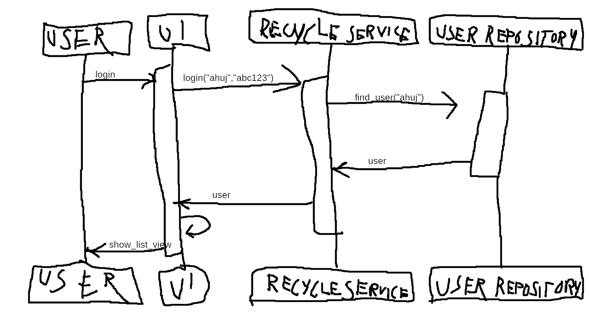

# Arkkitehtuuri

Kansio ui sisältää sovelluksen käyttöliittymään sisältyvän koodin.

Entities kansio sisältää käyttäjä olion.

Repositories kansiossa on käyttäjän toimintoihin liittyvä koodi.

Kansiossa services on sovelluslogiikka.

## käyttöliittymä

Sovelluksen käyttöliittymässä on viisi erilaista näkymää, jotka ovat:
-kirjautumisnäkymä

-listanäkymä

-rekisteröitymisnäkymä

-admin kirjautumisnäkymä

-admin näkymä

Jokaisella näkymällä on oma luokka. Luokista kutsutaan recycle servicen komentoja.

## Sovelluslogiikka

Sovelluksen tietomallin muodostaa User olio ja tietokantaan tallennetut tiedot.

Sovellus esittää tietoa sen perusteella mikä käyttäjä on kirjautunut sisään tarkistamalla tietokannasta tiedot sen käyttäjän kohdalla.

## Sekvenssikaavio käyttäjän sisäänkirjautumisesta

Kun käyttäjä on rekisteröitynyt ja kirjoittanut käyttäjätunnuksensa ja salasanansa sisäänkirjautumisruutuun, login näppäintä painaessa:

## Heikkouksia sovelluksessa

Kun adminkäyttäjä poistaa käyttäjän, ruutu ei päivity.

Käyttöliittymän koodissa suht. paljon toistoa.
