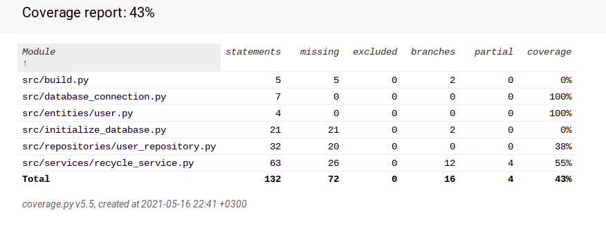

#Sovelluslogiikan testaus

Sovelluslogiikkaa, joka on luokassa RecycleService, testataan testiluokalla TestRecycleService. 

Luokalle annetaan käytettäväksi valeluokat Fakesql ja FakeUserRepository, jotka tallentavat tietoa väliaikaisesti tietokannan sijaan.

Testikattavuus on alhainen, vain 43 %

Testaamatta jäi paljon asioita, koska testattavat toiminnot toimivat liian läheisesti tietokannan kanssa.

Testattuja asioita ovat käyttäjän rekisteröiminen ja poistaminen.

Tämän lisäksi osittain testattu on listaan lisääminen.
